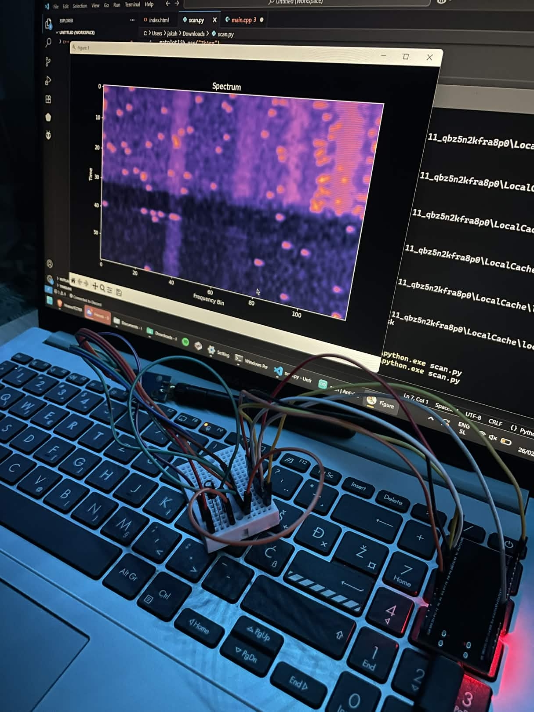
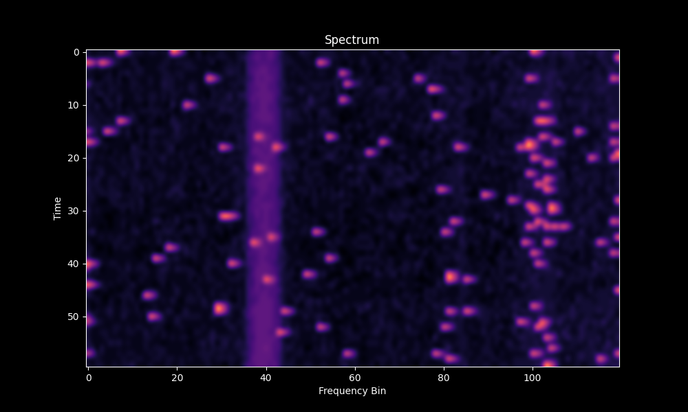

# CC1101 Waterfall Spectrum



This project is a real-time RF spectrum scanner using an ESP32 and CC1101 sub-GHz transceiver module. The scanner performs frequency sweep measurements and visualizes RSSI signal strength in real time.

## Features



- Live spectrum waterfall visualization  
- ESP32 serial communication with PC  
- RSSI signal plotting  
- Noise floor filtering  
- Responsive matplotlib GUI  

## Hardware Requirements

- ESP32 development board  
- CC1101 RF module  
- 433 MHz antenna  
- 10uF – 47uF capacitor (recommended)

## Wiring Table

| CC1101 Pin | ESP32 Pin |
|-------------|-------------|
| VCC | 3.3V |
| GND | GND |
| SCK | GPIO18 |
| MISO | GPIO19 |
| MOSI | GPIO23 |
| CSN | GPIO5 |
| GDO0 | GPIO4 |
| GDO2 |   / |

### Install Python Dependencies

```bash
pip install pyserial numpy matplotlib

